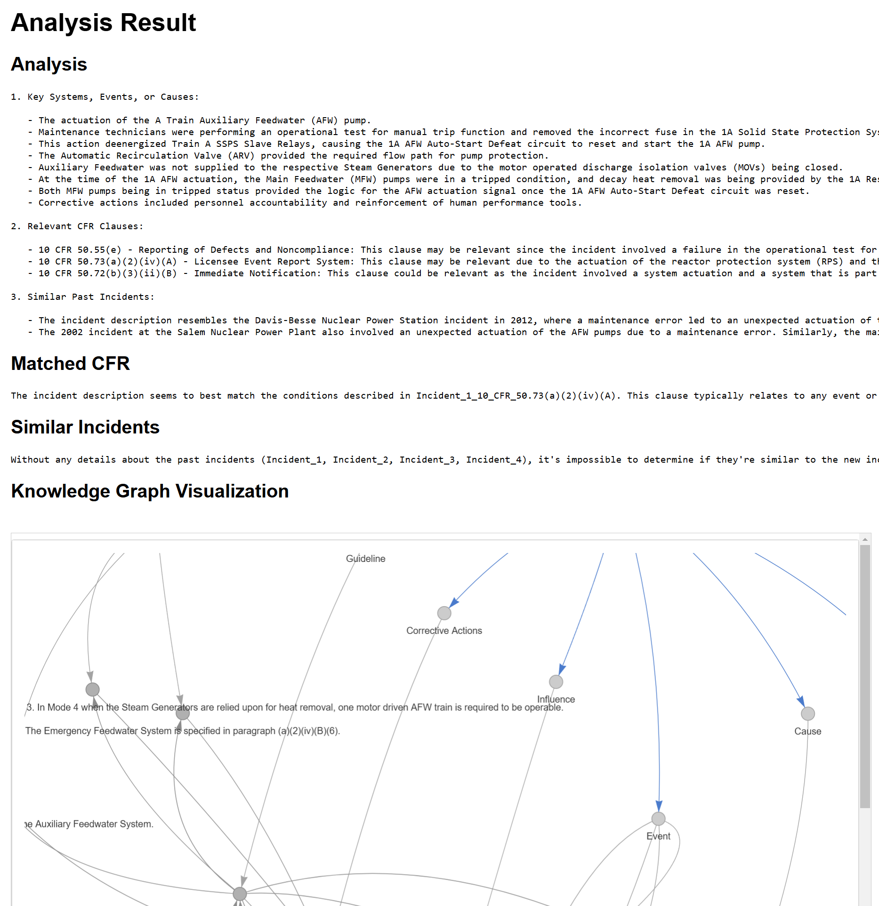

# Knowledge Graph-based Incident-Regulation Mapping System 🏠

[](https://www.python.org/)
[](LICENSE)

## 🎯 Overview
This project develops an automated system for mapping nuclear power plant incidents to relevant regulations using knowledge graph technology. The system aims to bridge the gap between explicit knowledge (regulations) and empirical knowledge (incident cases) in nuclear safety analysis.

## 🔊 Project Structure
```
├── .github/
│   └── workflows/
│       └── tests.yml
├── data/
│   ├── raw/               # Original data from sources
│   │   ├── ler/           # Licensee Event Reports
│   │   └── cfr/           # NRC regulations
│   ├── processed/         # Cleaned and processed data
│   │   ├── bin/
│   │   ├── ler_filtered/
│   │   ├── ler_text/
│   │   └── files (e.g., cfr.csv, ler_df.csv)
│   └── knowledge_graph/   # Generated knowledge graph data
├── src/
│   ├── preprocessing/
│   │   ├── __init__.py
│   │   ├── 1_ler_to_text.py
│   │   ├── 2_text_to_df.py
│   │   ├── 3_df_cleaner.py
│   │   ├── 4_ler_to_cfr.py
│   │   ├── 5_cfr_data.py
│   │   └── 6_extract_entity.py
│   ├── knowledge_graph/
│   │   ├── __init__.py
│   │   └── 7_knowledge_graph.py
│   └── run/
│       ├── __init__.py
│       └── main.py
├── .gitignore
├── LICENSE
├── README.md
├── requirements.txt
└── setup.py
```

## 🚀 Installation

### 1. Clone the repository
```bash
git clone https://github.com/separk-1/Incident-Regulation-Mapping-System-for-Nuclear-Safety-Analysis.git
cd Incident-Regulation-Mapping-System-for-Nuclear-Safety-Analysis
```

### 2. Create and activate conda environment
```bash
conda create -n kg-irm python=3.10
conda activate kg-irm
```

### 3. Install dependencies
```bash
pip install -r requirements.txt
python -m spacy download en_core_web_sm
```

## ⚙️ Configuration

### 1. Create a .env file in the project root:
```env
LER_API_KEY=your_api_key
```

## 📗 Usage

### 1. Data Extraction: Process Licensee Event Reports (LERs)
To process all LER PDFs and map their content to relevant fields (e.g., Facility Name, Title, LER Number, Event Date, Abstract, Narrative, and CFR), use the `1_ler_to_text.py` script:

```bash
python src/preprocessing/1_ler_to_text.py
```
1-1) 1_ler_to_text.py: Converts raw LER PDF files to text.
- **Input**: Raw LER PDF files (typically 4-5 pages including cover letters and incident records).
- **Output**: Extracted text using `pdfplumber`.

### 2. Data Cleaning and Transformation
Run scripts to clean text data and extract required fields:
```bash
python src/preprocessing/2_text_to_df.py
```
1-2) 2_text_to_df.py: Extracts specific elements from the text (excluding CFR).
- **Input**: Text extracted in the previous step.
- **Output**: Dataframe (CSV) containing Facility Name, Title, Event Date, LER Number, Abstract, Narrative, and File Name.

```bash
python src/preprocessing/3_df_cleaner.py
```
1-3) 3_df_cleaner.py: Filters out missing or "not found" data.
- **Input**: Dataframe from the previous step.
- **Output**: Cleaned CSV (removes rows with NaN values).

### 3. CFR Matching
Match processed LER data to CFR regulations:
```bash
python src/preprocessing/4_ler_to_cfr.py
```
2-1) 4_ler_to_cfr.py: Adds an empty CFR column.
- **Input**: Filtered CSV from the previous step.
- **Output**: Dataframe with `filename` and empty `CFR` columns.

```bash
python src/preprocessing/5_cfr_data.py
```
2-2) 5_cfr_data.py: Prepares data for manual CFR labeling.
- **Input**: Dataframe from the previous step.
- **Output**: Dataframe containing `CFR` and `content` columns for manual labeling.

2-3) Manual CFR Labeling: Label CFR data manually. (Automation planned for future versions.)

### 4. Knowledge Graph Construction
Build the knowledge graph from processed data:
```bash
python src/knowledge_graph/7_knowledge_graph.py
```
4) 7_knowledge_graph.py: Generates and visualizes the knowledge graph.
- **Input**: Processed CSV files.
- **Output**: Knowledge graph visualization and `.pkl` file for storage.

### 5. Entity Extraction and Inference
```bash
python src/preprocessing/6_extract_entity.py
```
3-1) 6_entity_extractor.py: Extracts attributes using GPT-4 API.
- **Input**: Narrative text.
- **Output**: JSON with extracted attributes:
  - Event
  - Cause
  - Influence
  - Corrective Actions
  - Similar Events
  - Guideline
  - Clause

```bash
python src/run/main.py
```
5) main.py: Performs retrieval and inference.
- **Input**: New data for analysis.
- **Output**: Closest CFR, reasoning, and similar incidents.
- **Test**: test model with data/example_prompt.json





## 🛠️ Dependencies

Main dependencies include:
- Python 3.10
- SpaCy
- Pandas
- pdfplumber
- NetworkX
- OpenAI API (for GPT-4 based entity extraction)

## ✅ License
This project is licensed under the MIT License. See the [LICENSE](LICENSE) file for details.

